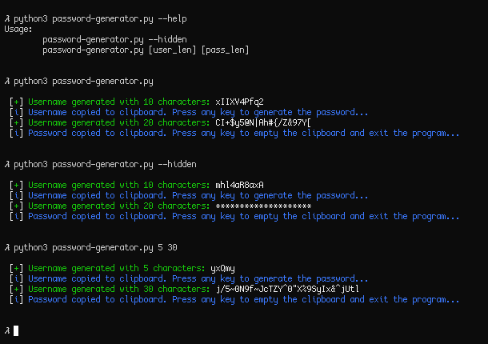

# Password generator
**Python script for generating a random username and password.**

Generates a random username and a random password with a specifiend length, and copies them to the clipboard. After the program finishes, it empties the clipboard.

### Installation
```bash
git clone https://github.com/r4v10l1/password-generator
cd password-generator
python3 password-generator.py [user_length] [pass_length]    # Arguments are optional
```

### Configuration
You can change the folowing variables:
* `PLAIN_TEXT_PASSWORD`: Boolean. If the variable is True, it will display the password on the screen when generated.
* `ONLY_USER`: Boolean. If true it will just generate an username, copy it and **not empty the clipboard**.
* `USER_LEN`: Integer. The username lenght.
* `PASS_LEN`: Integer. The password lenght.

Possible arguments (will use the specified settings if no arguments):
* `--help`: Shows the help
* `[user_len]`: The length of the username. If there is no second argument it will automatically set `ONLY_USER` to true.
* `[pass_len]`: The length of the password.

### Screenshots

