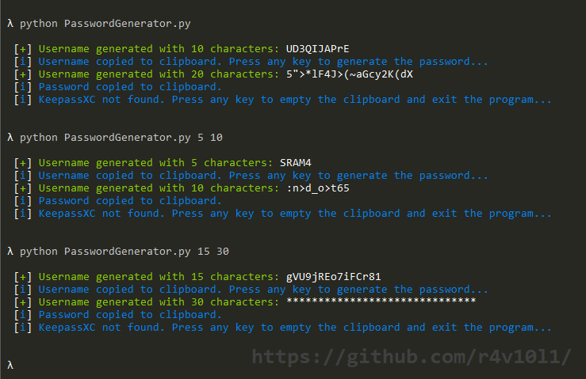

# Python password generator
**Python script for generating a random username and password.**

Generates a random username and a random password, and copies them to the clipboard. After the program finishes, it empties the clipboard.

### Installation
```bash
git clone https://github.com/r4v10l1/PasswordGenerator
cd PasswordGenerator
python PasswordGenerator.py [UsernameLenght] [PasswordLenght]  # Optional
```

### Configuration
You can change the folowing variables:
* PlainTextPassword: Boolean. If the variable is True, it will display the password on the screen when generated.
* UsernameLenght: Integer. The username lenght.
* PasswordLenght: Integer. The password lenght.

If there are 2 arguments (one for username lenght and one for password lenght) they will override them.

### Media

